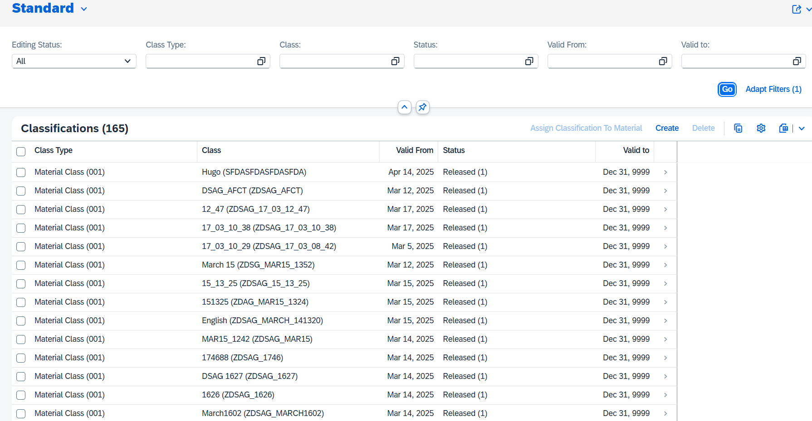
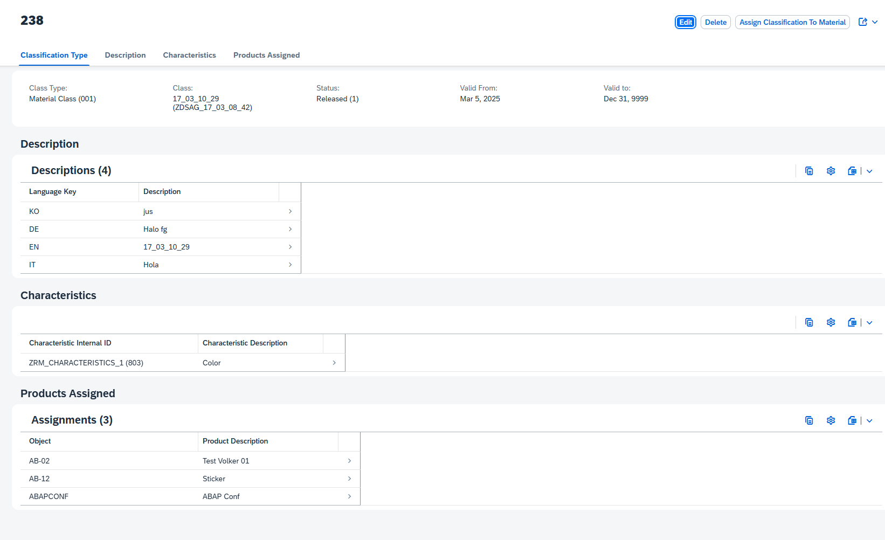
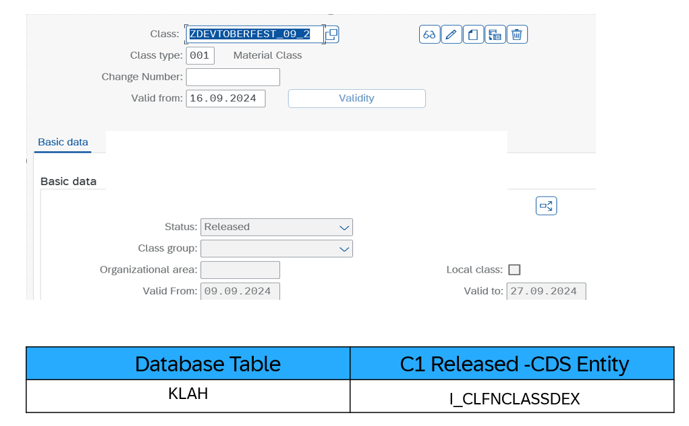
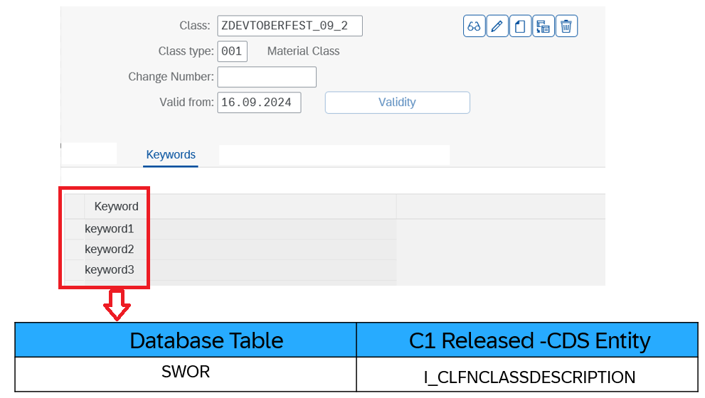
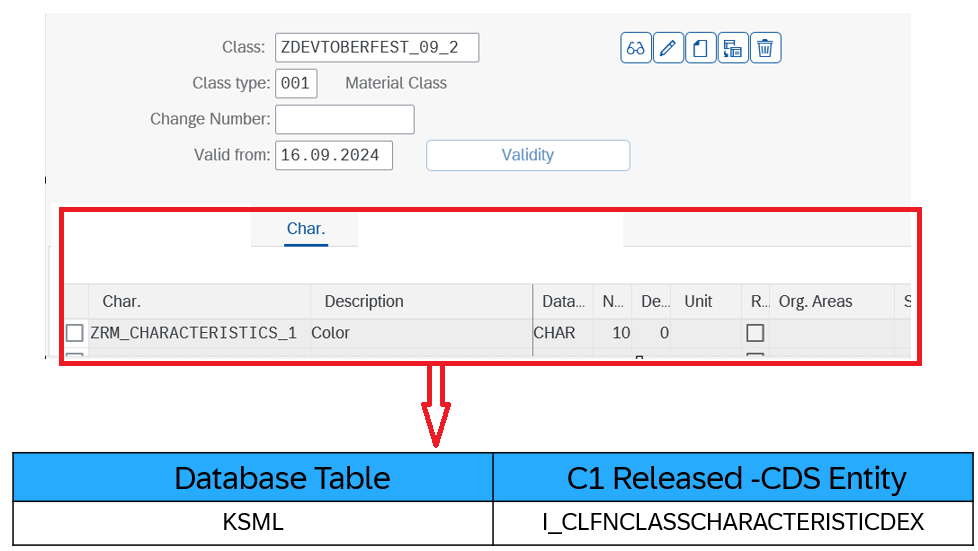
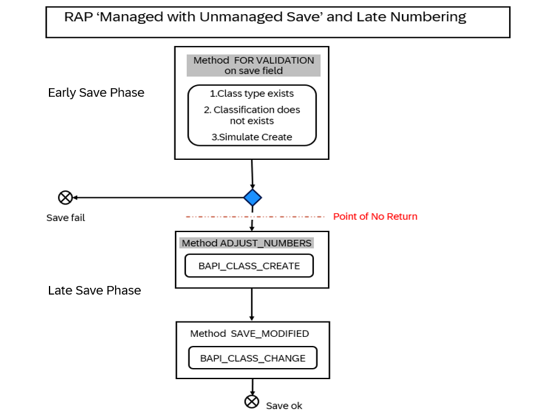

# Build transactional SAP Fiori elements-based Apps with nominated APIs using Tier 2 extensibility model in ABAP RESTful Application Programming Model (RAP)
> When you are developing an RAP Application in SAP S/4 Private Cloud Edition and you identify a artifact like `BAPI` which has a missing C1 released artifact but you find it as `nominated API` , you mitigate the situation by creating a Tier 2 wrapper  
>

You can have a brief understanding on: [ ABAP Cloud - How to mitigate missing released SAP APIs in SAP S/4HANA Cloud, private edition and SAP S/4HANA – The new ABAP Cloud API enablement guide](https://community.sap.com/t5/enterprise-resource-planning-blogs-by-sap/abap-cloud-how-to-mitigate-missing-released-sap-apis-in-sap-s-4hana-cloud/ba-p/13561479)

# Level: Intermediate

# Introduction

**Description**
This repository contains the material for the `Devtoberfest 2024- Clean Core Extensibility with ABAP Cloud in SAP S/4HANA Cloud Private Edition` . 

It includes two packages:
>ZDSAG_CLASIFICATION_CLOUD(ABAP Cloud Language Version) - Contains managed Business Object (BO) with BO nodes or entities, BO projection views, late numbering, determine actions, actions, side effects, functions, business event exposure, and additional save.

>ZDSAG_CLASSIFICATION_C1( Standard ABAP Language Version) - Contains wrapper for Nominated APIs and CDS entity for not C1 released artifact.

## Table of Content
- [Requirements](#requirements)
- [Overview](#overview)
- [Solution Overview](#solution-overview)
- [How to download and install this example](#how-to-download-and-install-this-example)
- [Configuration](#configuration)
- [Recording](#recording)
- [How to obtain support](#how-to-obtain-support) 
- [Further Information](#ℹfurther-information)
## 📋 Requirements

[Requirements section](../main/README.md#requirements) of branch <em>`Main`</em> 

## 🔎Overview

> This repository is all about how to build wrapper around nominated APIs and use it as RAP BO  ; especially about how to use  when building greenfield implementations.

  
Click to expand!

### Business Scenario
In a nutshell
> We create/update `Classification` using nominated APIs
> 
> Assign the `Classification` to `Material Master` using nominated API.
>
> If the Material is assigned with `Classification` for the first time we raise an BOR event 
>
> 
This session material guides you through the development of the OData service of a SAP Fiori elements based _Classification Processing App_ with RAP, using the _managed_ business object (BO) runtime implementation with unmanaged save and  late numbering.
>  
> Here we chose  `unmanaged save` as we intend to use nominated APIs aka `BAPI` for CRUDQ trasanctional capabilities .
>
The OData service you are going to implement is based on the SAP GUI transaction CL01/CL02/CL03.
>
> To set the business context, the scenario is the following: The department responsible for managing "Classification" is requesting you to build a new Fiori app with draft capabilities for processing (i.e. creating, updating and deleting) classification.
>

  
Click to expand!

>Scenario 1: Creation and Update existing `Classification`
>
The resulting _Classification Processing App_ app is a SAP Fiori elements-based List Report app with search, filter, and draft capabilities for processing _Classification_ . A navigation to an Object Page for displaying the details of each _Classification_ entry in the list report is offered. The application will look like this: 

**List Report**:

  
**Object Page**: 

Let us breakdown of  SAP GUI transaction _CL01_ which comprises of different section(information stored across multiple database)   _Classification App_ .

**Basic Data**:

**Keywords**:

**Characteristics**:

**So we would be building a RAP application that would be a mimic of these sections from CL01/CL02/CL03.**

**Disclaimer**: We have taken only few sections from CL01 transaction for this sample.

Below is the simplified _Classification_ data model underlying the app.

>Scenario 2: Assign existing `Classification` to a `Material Master`
>
We use nominated API , to assign existing `Classification` to existing `Material`.

> We achieve this help of `Action` in RAP.

**Action to do this assignment of Classification to Material**:

**We can do this in classic way directly using SAP GUI transaction MM01/MM02**:

## 🛠 Solution Overview

> You can import the solution package **`ZDSAG_CLASSIFICATION_C1`** **`ZDSAG_CLASIFICATION_CLOUD`** into your system* by following [How to download and install this example](#how-to-download-and-install-this-example). 
>
> (*) The supported ABAP systems are 2023 of SAP S/4HANA Cloud Private Edition and SAP S/4HANA.

  
Click to expand!

**ZDSAG_CLASSIFICATION_C1**

>Lets see what are the objects present in this package:

1. ZDSAG_BAPI_CLASS_CREATE - Tier 2 Wrapper for nominated API of Classification Creation - `BAPI_CLASS_CREATE`
2. ZDSAG_BAPI_CLASS_CHANGE - Tier 2 Wrapper for nominated API of Classification Update -`BAPI_CLASS_CHANGE`
3. ZDSAG_BAPI_OBJCL_CREATE - Tier 2 Wrapper for nominated API of Classification Assignment to Material Master - `BAPI_OBJCL_CREATE`
4. ZDSAG_GET_CLASS_DETAIL  - Tier 2 Wrapper for reading existing 'Classification' details - here we combine usage of nominated API `BAPI_CLASS_GET_CHARACTERISTICS` and `I_CLFNCLASS`(Basic Data) and `I_CLFNCLASDESCRIPTION`(Keywords).
5. ZDSAG_BOR_EVENT_HANDLER - BOR Event Handler Implementation

**Note:**  
The package contains other objects as well, but we have given overview of only few key artifacts.

**ZDSAG_CLASIFICATION_CLOUD**

>Lets see what are the objects present in this package:

>BO - Business Object

1. ZDSAG_R_CLASSIFICATION - Root BO for `Basic Data`
2. ZDSAG_C_CLASSIFICATION - Root BO Projection View
3. ZDSAG_R_CLASSDESCRIPTION - BO for `Keywords`
4. ZDSAG_C_CLASSDESCRIPTION - Projection view for `Keywords` BO
5. ZDSAG_R_CLASSCHARACTERS - BO for `Characteristics`
6. ZDSAG_C_CLASSCHARACTERS - Projection view for `Characteristics` BO
7. ZDSAG_A_CLASSIFICATION_CREATE - Abstract entity for `Classification` created RAP event

**Note:**  
The package contains other objects as well, but we have given overview of only few key artifacts.

  

## 📤 How to download and install this example

Use the <em>zabapgit_standalone</em> program to install the <em>RAP Nominated APIs consumption Scenario</em> by executing the following steps:
1.  Create software component `ZABAP_ON_CLOUD` using `ABAP For Cloud` as `ABAP Language Version` as mentioned in `Requirement` section of this file.
2.	In your ABAP project, create the package `ZCLASSIFICATION_SAMPLE` as target package for the demo content. Use `ZABAP_ON_CLOUD` as software component. Assign it to a new transport request that you only use for the demo content import. 
3.	In your ABAP project, run the program `zabapgit_standalone`.  
4.	Choose `New Online` and enter the following URL of this repository  `https://github.com/SAP-samples/abap-platform-nominated-apis-consumption`.
5.	To select the Classification-maintenance branch, choose `Branch` > `Switch` and select `ABAP-platform-2023-classification-maintenance`. 
6.	In the package field, enter the newly created package `ZCLASSIFICATION_SAMPLE`. In the branch field, select the branch `ABAP-platform-2023-classification-maintenance`.
7.	Leave the other fields unchanged and choose `Create Online Repo`.
8. Enter your credentials for abapgit. You will see the available artifacts to import into your ABAP system. 
9.	Choose `Pull` and confirm every subpackage on your transport request. 
10.	Select the package `ZCLASSIFICATION_SAMPLE` to be overwritten with the demo content. 
11. You will get an information screen telling you to only make repairs when they are urgent, which you can confirm.  
12. In the following screen, select all inactive objects and confirm the activation.
13.	Once the cloning has finished, refresh your project tree.

As a result of the installation procedure above, the ABAP system creates an inactive version of all artifacts from the demo content and adds the following sub packages to the target package: 
* `ZDSAG_CLASSIFICATION_C1`
* `ZDSAG_CLASIFICATION_CLOUD`

## Configuration

To generate service artifacts for the service bindings:
1. In each service binding, choose the button `Publish`.

NOTE: In case the activation via the button in the service bindings is not possible, you can use Gateway tools to activate the service, see [here](https://help.sap.com/docs/ABAP_PLATFORM_NEW/fc4c71aa50014fd1b43721701471913d/b58a3c27df4e406f9335d4b346f6be04.html?version=202210.LATEST#%EE%81%B0-service-transport2).  

## 📹Recording 
[^Top of page](#)

For a compact overview of this repository , watch the session replay from SAP Devtoberfest 2024 (_gated content_):  

⏺  [Clean Core Extensibility with ABAP Cloud in SAP S/4HANA Cloud Private Edition - Youtube Video ](https://www.youtube.com/watch?v=HQPXI1Ba-Gk&list=PL6RpkC85SLQDHz97qsNTNAE2jnUKj8X5d&index=65)

**Note:**  
The code available in this repository is slightly different from this recording.

## Known Issues
<!-- You may simply state "No known issues. -->

## How to obtain support
[How to obtain support section](../main/README.md#how-to-obtain-support) of branch <em> Main </em> 
 
## Contributing
[Contributing section](../main/README.md#contributing) of branch <em> Main </em> 
 
For additional support, [ask a question in SAP Community](https://answers.sap.com/questions/ask.html).
## Contributing
If you wish to contribute code, offer fixes or improvements, please send a pull request. Due to legal reasons, contributors will be asked to accept a DCO when they create the first pull request to this project. This happens in an automated fashion during the submission process. SAP uses [the standard DCO text of the Linux Foundation](https://developercertificate.org/).
