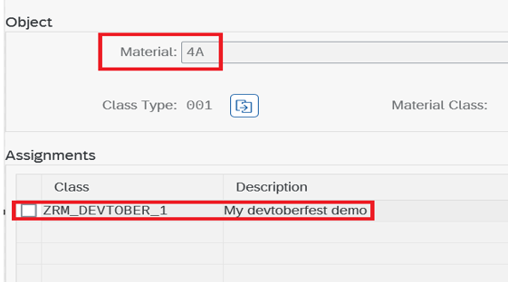

# Build transactional SAP Fiori elements-based Apps with nominated APIs using Tier 2 extensibility model in ABAP RESTful Application Programming Model (RAP)
> When you are developing an RAP Application in SAP S/4 Private Cloud Edition and you identify a artifact like `BAPI` which has a missing C1 released artifact but you find it as `nominated API` , you mitigate the situation by creating a Tier 2 wrapper  
>

You can have a brief understanding on: [ ABAP Cloud - How to mitigate missing released SAP APIs in SAP S/4HANA Cloud, private edition and SAP S/4HANA – The new ABAP Cloud API enablement guide](https://community.sap.com/t5/enterprise-resource-planning-blogs-by-sap/abap-cloud-how-to-mitigate-missing-released-sap-apis-in-sap-s-4hana-cloud/ba-p/13561479)

# Level: Intermediate

# Introduction

**Description**
This repository contains the material for session `AD106 | Clean core extensibility of SAP S/4HANA Cloud Private Edition with ABAP Cloud` in SAP Teched 2024

It includes two packages:
>ZDSAG_PRODUCT_LIST_CLOUD(ABAP Cloud Language Version) - Contains managed Business Object (BO) with BO nodes or entities, BO projection views, actions, business event exposure.

>ZDSAG_PRODUCT_LIST_C1( Standard ABAP Language Version) - Contains wrapper for Nominated APIs and CDS entity for not C1 released artifact.

## Table of Content
- [Requirements](#requirements)
- [Overview](#overview)
- [Business Scenario](#business-scenario)
- [Solution Overview](#solution-overview)
- [How to download and install this example](#how-to-download-and-install-this-example)
- [Configuration](#configuration)
- [Recording](#recording)
- [Known Issues](#known-issues)
- [How to obtain support](#how-to-obtain-support) 
- [Further Information](#ℹfurther-information)

## 📋 Requirements

[Requirements section](../main/README.md#requirements) of branch <em>`Main`</em> 

## 🔎Overview

> This repository is all about how to build wrapper around nominated APIs and use it as RAP BO  ; especially about how to use  when building greenfield implementations.

  
Click to expand!

### Business Scenario
In a nutshell
> We display the list of available Products from `Product Master` (MM03) in system
> 
> Assign the `Product Master` to `Classification` using nominated API.
>
> If the Product is assigned with `Classification` for the first time we raise an BOR event 
>
> 
This session material guides you through the development of the OData service of a SAP Fiori elements based _Classification Assignment to Product App_ with RAP, using the _managed_ business object (BO) runtime implementation .
>  
The OData service you are going to implement is based on the SAP GUI transaction MM01/MM02.
>
> To set the business context, the scenario is the following: The department responsible for managing  "Products  & Classification" is requesting you to build a new display only Fiori app  for processing assignment of Product with Classification.
>

  
Click to expand!

>Scenario : Assign existing `Materail Master` to a `Classification`

>We use nominated API , to assign existing `Product` to existing `Classification`.

> We achieve this help of `Action` in RAP.

**List Report**:

**Object Page-Action to do this assignment of Product to Classification**:

**We can do this in classic way directly using SAP GUI transaction MM01/MM02**:

## 🛠 Solution Overview

> You can import the solution package **`ZDSAG_PRODUCT_LIST_C1`** **`ZDSAG_PRODUCT_LIST_CLOUD`** into your system* by following [How to download and install this example](#how-to-download-and-install-this-example). 
>
> (*) The supported ABAP systems are 2023 of SAP S/4HANA Cloud Private Edition and SAP S/4HANA.

  
Click to expand!

**ZDSAG_PRODUCT_LIST_C1**

>Lets see what are the objects present in this package:

1. ZCL_DSAG_BAPI_OBJCL - Tier 2 Wrapper for nominated API of Product Master to Classification Assignment - `BAPI_OBJCL_CREATE`
2. ZCL_DSAG_CLASS_ASSIGNMENT_CHK  - Tier 2 Wrapper for checking existing `Classification` details assigned to `Product Master` before triggering assignment .
3. ZCL_DSAG_BOR_HANDLER_PRODUCT - BOR Event Handler Implementation

**Note:**  
The package contains other objects as well, but we have given overview of only few key artifacts.

**ZDSAG_PRODUCT_LIST_CLOUD**

>Lets see what are the objects present in this package:

>BO - Business Object

1. ZDSAG_R_PRODUCT - Root BO for `Product Master`
2. ZDSAG_C_PRODUCT - Root BO Projection View
3. ZDSAG_I_CLASSIFICATIONHELPER - BO for `Classification`
4. ZDSAG_I_CHARACTERISTICHELPER - BO for `Characteristics`
   
**Note:**  
The package contains other objects as well, but we have given overview of only few key artifacts.

  

## 📤 How to download and install this example

Use the <em>zabapgit_standalone</em> program to install the <em>RAP Nominated APIs consumption Scenario</em> by executing the following steps:
1.  Create software component `ZABAP_ON_CLOUD` using `ABAP For Cloud` as `ABAP Language Version` as mentioned in `Requirement` section of this file.
2.	In your ABAP project, create the package `ZPRODUCT_ASSIGNMENT_SAMPLE` as target package for the demo content. Use `ZABAP_ON_CLOUD` as software component. Assign it to a new transport request that you only use for the demo content import. 
3.	In your ABAP project, run the program `zabapgit_standalone`.  
4.	Choose `New Online` and enter the following URL of this repository  `https://github.com/SAP-samples/abap-platform-nominated-apis-consumption`. 
5.	In the package field, enter the newly created package `ZPRODUCT_ASSIGNMENT_SAMPLE`. In the branch field, select the branch `ABAP-platform-2023-classification-maintenance`.
6.	Leave the other fields unchanged and choose `Create Online Repo`.
7. Enter your credentials for abapgit. You will see the available artifacts to import into your ABAP system. 
8.	Choose `Pull` and confirm every subpackage on your transport request. 
9.	Select the package `ZPRODUCT_ASSIGNMENT_SAMPLE` to be overwritten with the demo content. 
10. You will get an information screen telling you to only make repairs when they are urgent, which you can confirm.  
11. In the following screen, select all inactive objects and confirm the activation.
12.	Once the cloning has finished, refresh your project tree.

As a result of the installation procedure above, the ABAP system creates an inactive version of all artifacts from the demo content and adds the following sub packages to the target package: 
* `ZDSAG_PRODUCT_LIST_C1`
* `ZDSAG_PRODUCT_LIST_CLOUD`

## Configuration

To generate service artifacts for the service bindings:
1. In each service binding, choose the button `Publish`.

NOTE: In case the activation via the button in the service bindings is not possible, you can use Gateway tools to activate the service, see [here](https://help.sap.com/docs/ABAP_PLATFORM_NEW/fc4c71aa50014fd1b43721701471913d/b58a3c27df4e406f9335d4b346f6be04.html?version=202210.LATEST#%EE%81%B0-service-transport2).  

## 📹Recording 
[^Top of page](#)

For a compact overview of this repository , watch the session replay from SAP Teched 2024 (_gated content_):  

⏺  [AD106 | Clean core extensibility of SAP S/4HANA Cloud Private Edition with ABAP Cloud](https://www.sap.com/events/teched/virtual/flow/sap/te24/catalog/page/catalog/session/1721791179982001rM76)

**Note:**  
The code available in this repository is slightly different from this recording.

## Known Issues
<!-- You may simply state "No known issues. -->

## How to obtain support
[How to obtain support section](../main/README.md#how-to-obtain-support) of branch <em> Main </em> 
 
## Contributing
[Contributing section](../main/README.md#contributing) of branch <em> Main </em> 

## License
Copyright (c) 2024 SAP SE or an SAP affiliate company. All rights reserved. This project is licensed under the Apache Software License, version 2.0 except as noted otherwise in the [LICENSE](LICENSE) file.
